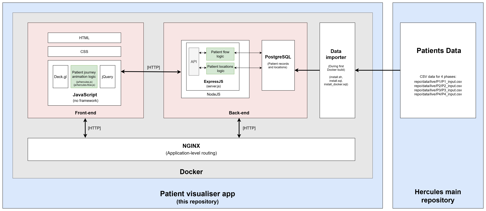

# Hercules Web 
[](https://github.com/ucl-casa-ce/hercules-web/actions/workflows/main.yml)

This repository contains the visualisation application for the Hercules Project.  The other components to this project are contained in the main [Hercules repository](https://github.com/djdunc/hercules)

## Try the dashboard

The live dashboard can be accessed here: [https://hercules.cetools.org/patient-flow.html](https://hercules.cetools.org/patient-flow.html)

## Demo video

https://github.com/user-attachments/assets/4d0146e2-fe47-4b9c-9a78-59cb82032b36

## How it works
This app simply plays back patient journeys as they happened on the test day. By utilising Ubisense location data, the app utilises an open-source tool from Deck.gl ([Trips Layer](https://deck.gl/docs/api-reference/geo-layers/trips-layer)) to animate the path for each patient. The app is also capable of controlling the playback (pausing, going forward or backwards), in addition to advanced filtering according to patient cases, experiment number, or specific patient ID.

## Application architecture
The data comes from the main [Hercules repository](https://github.com/djdunc/hercules), where a Docker script does the importing process. Data is stored in a PostgreSQL database for the API to use.
The Express.js server is responsible for aggregating the data and then sending it via the RESTful API to the Frontend. On the frontend side, jQuery receives the data and handles user interaction. The heavy animation logic is contained in the `hercules-flow.js` file. NGINX is responsible for routing HTTP requests from/to the application.




## Getting Started

This project is designed to be run with Docker. Follow these steps to get a local instance up and running for development.

### Prerequisites

- [Docker](https://www.docker.com/get-started) and [Docker Compose](https://docs.docker.com/compose/install/)

### Installation

1.  Clone this repository to your local machine:
    ```bash
    git clone https://github.com/ucl-casa-ce/hercules-web.git
    cd hercules-web
    ```

2.  Build and run the Docker container. This command will set up the database, import the data, and start the web server.
    ```bash
    docker-compose up --build
    ```
    The initial build may take some time as it downloads and configures the environment.

3.  Once the build is complete and the services are running, you can access the application in your web browser at:
    [http://localhost:8888/patient-flow.html](http://localhost:8888/patient-flow.html)

Any changes made to the `front-end` or `back-end` directories will be reflected after rebuilding the container.


## Backend API documentation

The backend is an **Express.js** application that serves data from the PostgreSQL database. It provides several RESTful API endpoints that the frontend uses to fetch patient journey data and experiment metadata. The NGINX server proxies requests from `/api/...` to this server.

The base URL for the API in the Docker environment is `/api/`.

### Main Endpoints

#### Get Data for a Single Patient
-   **Endpoint**: `GET /api/data/:expID/:pat_id`
-   **Description**: Retrieves all location points and metadata for a specific patient in a given experiment.
-   **Parameters**:
    -   `:expID`: The experiment number (e.g., `1`).
    -   `:pat_id`: The patient ID (e.g., `G0132`).

#### Get Flow Data for a Group of Patients
-   **Endpoint**: `POST /api/data/flows/group/:expID/zerostart/:zerostart/colourconfig/:colourConfig`
-   **Description**: Retrieves the formatted journey paths for a list of patients, ready for animation with Deck.gl.
-   **Parameters**:
    -   `:expID`: The experiment number.
    -   `:zerostart`: `1` to make all journey timestamps start from zero, `0` to use timestamps relative to the earliest start time in the group.
    -   `:colourConfig`: `1` to color paths by patient condition (Retina, Glaucoma, etc.), `0` for random colors.
-   **Payload**: A JSON object containing an array of patient IDs.
    ```json
    {
      "group": ["R0520", "R0501", "G0132"]
    }
    ```

### Metadata and Filtering Endpoints

#### Get Experiment Information
-   **Endpoint**: `GET /api/getExperimentInfo/:expID`
-   **Description**: Returns metadata for an experiment, including start/end times, total patient count, and a breakdown of patients by condition (Cataract, Glaucoma, Retina, Staff).

#### Get Patients by Day of Week
-   **Endpoint**: `GET /api/data/:expID/dow/:dow`
-   **Description**: Returns a list of patients who visited on a specific day of the week.
-   **Parameters**:
    -   `:dow`: Day of the week (e.g., `Monday`).

#### Get Patients by Time of Day
-   **Endpoint**: `GET /api/data/:expID/tod/:tod`
-   **Description**: Returns a list of patients who visited during a specific time of day.
-   **Parameters**:
    -   `:tod`: Time of day (`morning` or `afternoon`).

#### Get Patients by Condition
-   **Endpoint**: `GET /api/data/:expID/condition_type/:condition`
-   **Description**: Returns a list of patients with a specific condition.
-   **Parameters**:
    -   `:condition`: The condition code (`C`, `G`, `R`, or `S`).
